## Table of Contents
* [Background](#Background)
* [Features](#Features)
* [Technologies Used](#Technologies-Used)
* [Walkthrough](#Walkthrough)
* [Design and Future Plans](#Design-and-Future-Plans)

___

## Background
I created this web application for a mechanic shop to use as a CRM and to manage all of the aspects of running a mechanic business. I grew up working on cars with my dad, who was a mechanic most of his life. I thought this would be a fun project to do as my first project, even if I don't know much about the business!

[Return to Table of Contents](#Table-of-Contents)

___

## Features
* General Features
    * Login and Admin User Registration with server side validations

    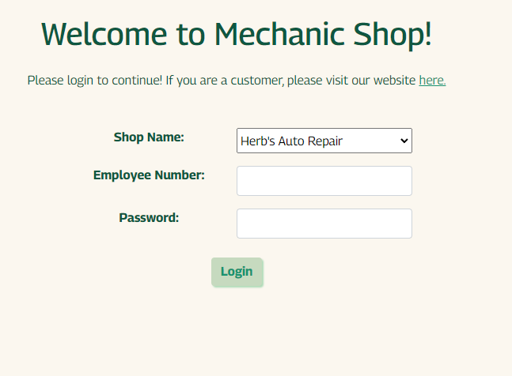  
    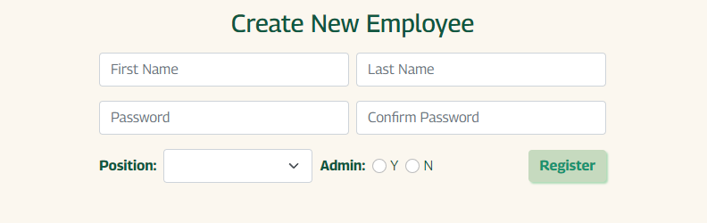  

    * Dashboard with all open jobs assigned to the logged in user displaying

    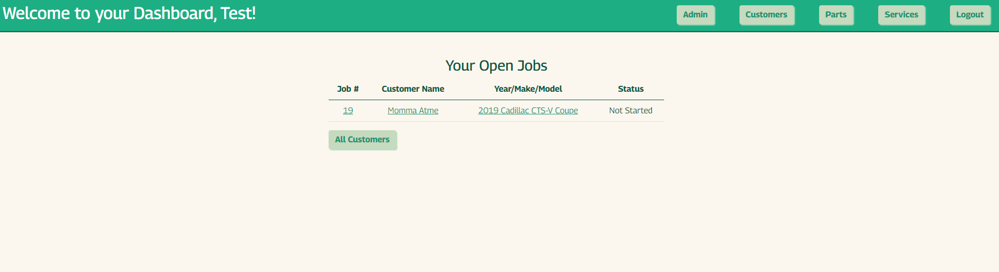  

    * View all customers and add a new customer

    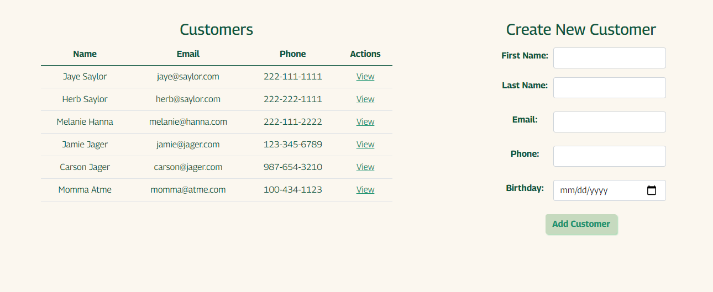  

    * View a customer and their cars, and add a new car

    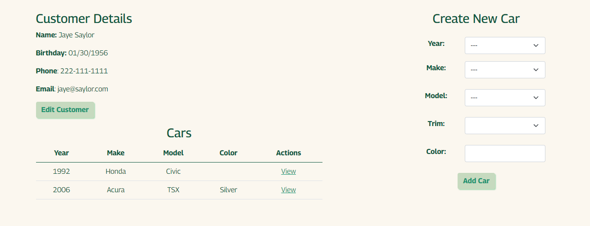

    * Edit/delete a customer in place

    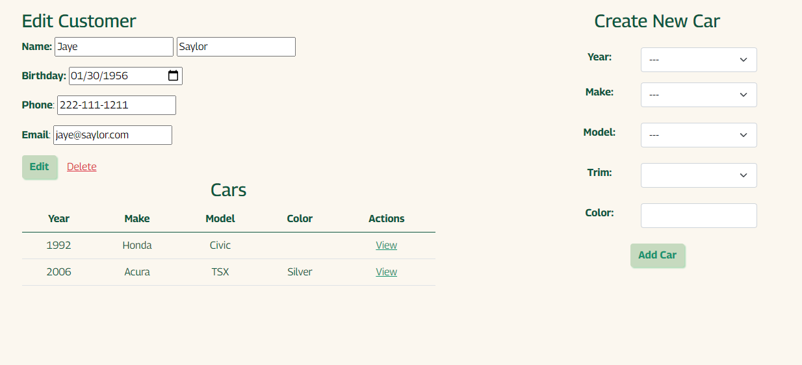

    * View a car and any jobs for that car, and add a new job.

    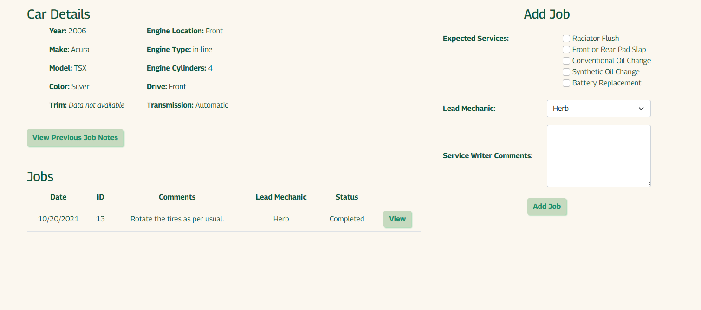

    * View a list of notes from all jobs for that car in place

    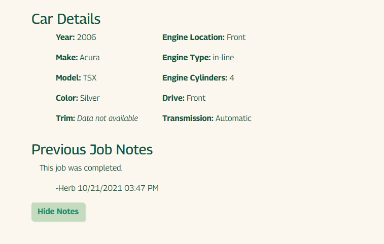

    * View a list of services and parts that are required for that service
    * Change the status of the job
    * Add more services if needed
    * Add notes to the job

    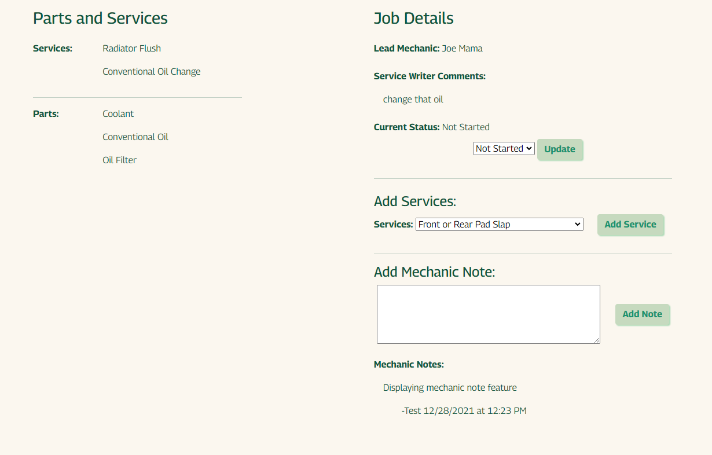

    * View a list of parts, create a new part, and delete a part

    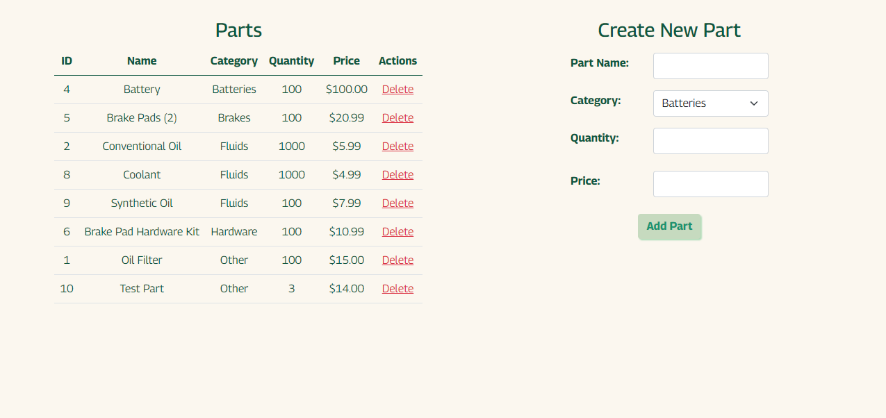

    * View a list of services, create a new service with parts, and delete a service

    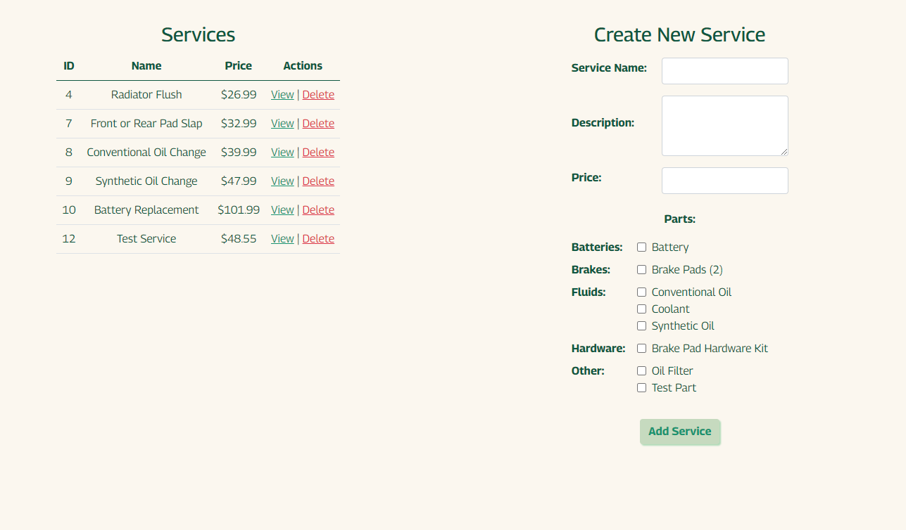

    * View a service and add/remove parts to it

    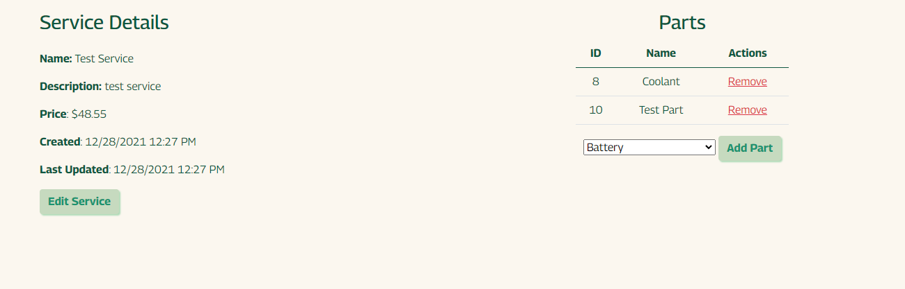

    * Edit service details in place

    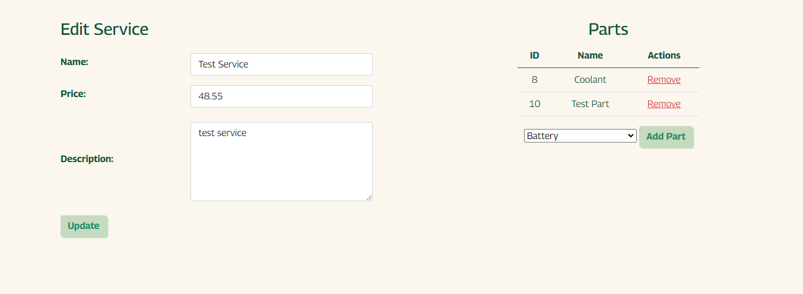

* Admin Features  
    * Create a new employee

    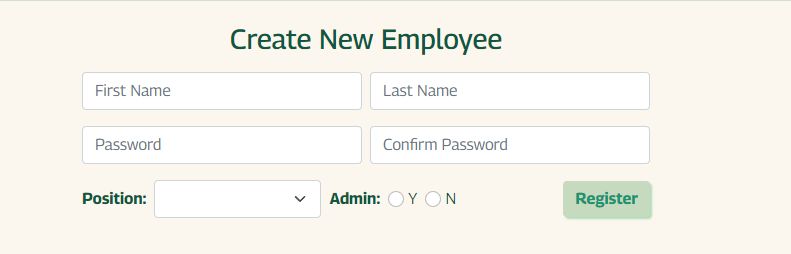

    * View all open jobs

    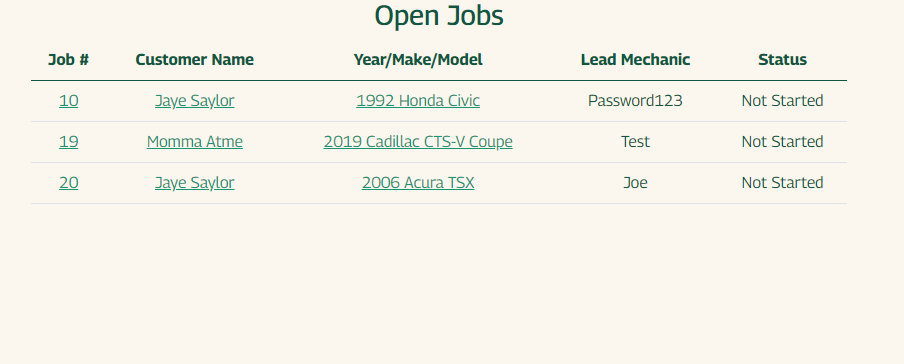

    * View all employees

    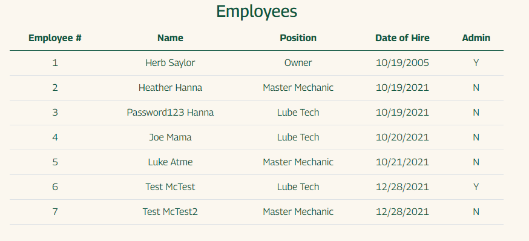

[Return to Table of Contents](#Table-of-Contents)
___

## Technologies Used
* HTML, CSS, JavaScript and Bootstrap -- intuitive and pleasant user experience
* Python, MVC design, RESTful routing -- display dynamic data with MySQL back-end
* MySQL -- one-to-many and many-to-many relationships
* CarQuery API and module -- create cascading, responsive car dropdowns and display car information based on make/model/year/trim
* Session -- enable admin dashboard and keep track of logged in user 
* BCrypt and Regex to ensure password complexity

[Return to Table of Contents](#Table-of-Contents)

___

## Walkthrough
Upon loading the web application, the user arrives on the login page. They must know their employee ID and password to login. When they login successfully, they'll be redirected to the dashboard which displays all jobs assigned to the user that have not been completed. The user can go directly to any of those open jobs if they need to, or begin the process from the beginning. To show the whole process from start to finish, I'm going to start fresh with a new customer.

To create a new customer, the user will go to the All Customers list. There is a form to fill out with the customer's basic information. Once the user has created the customer, they'll be redirected to the customer page. If they need to make any edits, they can click "Edit Customer" to edit the customer in place without leaving the page. Otherwise, the user can create a new car using the dropdowns provided by the CarQuery API module to make it easier to find a car by narrowing the results of the next dropdown.

Once the car has been created, the user will be redirected to the car details page. There is an issue with the API where it displays an error pop-up, however once you dismiss it, all is well. The left column of car details is user input, the right column of car details is pulled from the CarQuery API. From here, you can see any jobs or previous job notes on the car if there were any, however since this is a new car there aren't any. The user can add a job for the car, selecting any services they are expecting to perform on the car at this time, set the Lead Mechanic, and add any comments about the job from speaking to the customer.

When the user submits the form, the job will be added to the table. The user can then view the new job. On the job page, it will show a list of all services, and the parts associated with that service. The user will be able to change the job status, add services, and add notes to the job in place without leaving the page. Once the job status has been completed, the user cannot make any more edits.

The user is also able to add parts, and then add services that have parts included with it by default. The user can delete parts and services, and can edit a service. From a service, they can add and delete parts to/from the service.

[Return to Table of Contents](#Table-of-Contents)

___

## Design and Future Plans
I designed this project to be as user friendly as possible. The times I take my car to Jiffy Lube, it looks like the employees aren't super happy with the software since they have to tab through a million fields to get anything accomplished.

I have some future plans for this project. I'd like to implement an inventory management system so that managers will know when they need to order new parts and employees can warn customers that a part is out of stock, so they may need to wait. I would also like to add a customer lookup feature to make it easier to find a customer when the user needs to start a new job. I'd also like to make an itemized receipt for the customer that will be a printable PDF.

Currently, this is not mobile/tablet friendly. I would like to make version that would be responsive based on screen size since that is extremely important in today's world.

[Return to Table of Contents](#Table-of-Contents)
=======
# mechanic_shop

Mechanic Shop:
The concept behind this project is to have an internal software for a Mechanic Shop so that the owner, admin and mechanics to use to maintain a database of customers, cars and their jobs.

Technologies:
This web app was built in Python using the Flask framework, and the database is done with MySQL. 
The styling is done using a mixture of Bootsrap classes and custom classes.

API/External Sources:
CarQuery API
CarQuery Module
>>>>>>> b7ad9c51f965a04102f41567ac77f41e7dbc3089
